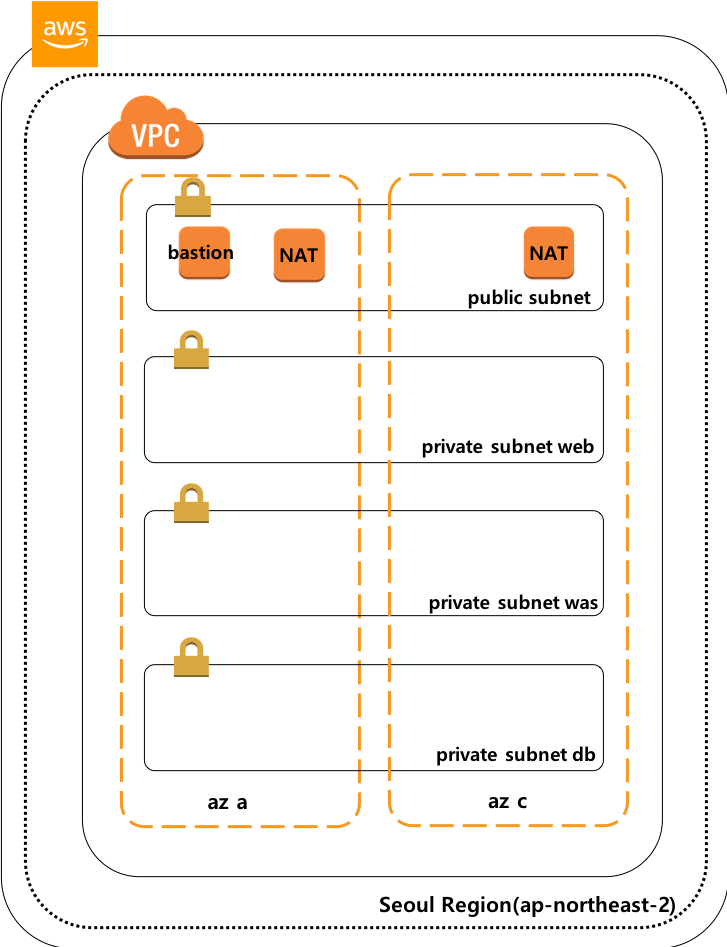
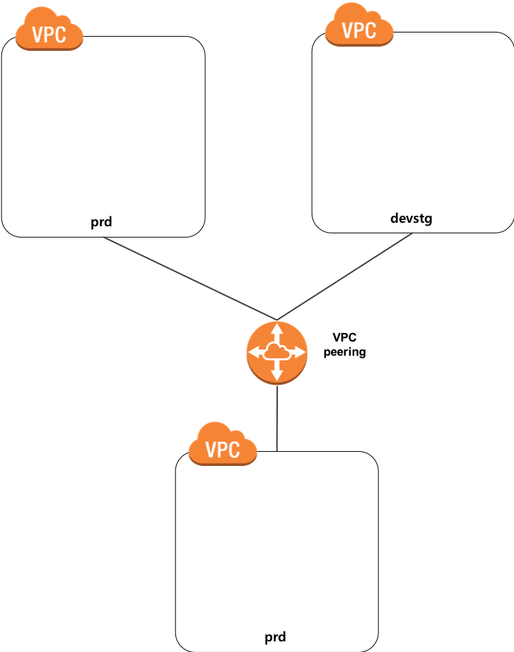

# AWS Multi VPC를 Terraform으로 구성

## 들어가면서
* AWS 상에 뭔가를 해보려면 VPC, Subnet 그리고 Bastion까지가 기본 구성이라 볼 수 있다.
* 여기서는 prd, devstg, mgmt용으로 3개의 VPC를 구성한다.
prd: 상용 환경 / devstg: dev 및 stage / mgmt: 관리용
* 각 VPC는 4개의 Subnet으로 구성 된다.
* 각각의 subnet은 public 1개, private 3개로 public에는 외부 접속, private은 web, was, db 영역이다.
* 3개의 VPC는 mgmt를 기준으로 peering으로 구성된다.
* mgmt에 구성된 bastion에서만 devstg 및 prd bastion에 접근가능

## 구성
* 
  * prd, devstg, mgmt는 모두 위와 같은 형태로 구성됨.
* 

## 실행 절차
* 협업을 위한 state 파일을 관리할 환경 구성
```
cd 'user_folder'/project/backend
terraform init
terraform plan
terraform apply
```

* VPC 구성 & VPC Peering
```
cd cd 'user_folder'/project/multi-vpc
./apply.sh      # 3개의 VPC 기본 환경 / Peering / Bastion 구성
./destory.sh    # 구성 모든 resource 삭제
./bastion.sh    # mgmt bastion 접속
```
* 참고 사항
  * terraform을 통한 인프라 구성
  (https://blog.2dal.com/2017/09/17/aws-vpc-network-with-terraform/)
  * direnv를 통한 aws key 관리(https://www.44bits.io/ko/post/direnv_for_managing_directory_environment)
